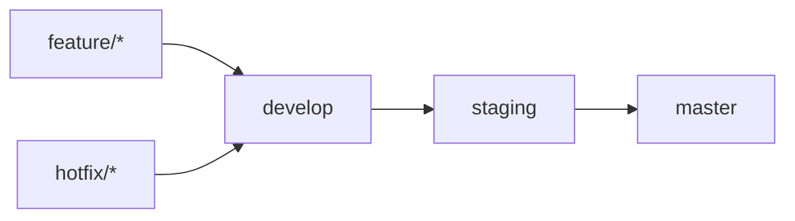
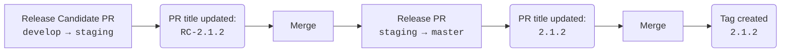

# Semi-automated Versioning Workflow

Zero-dependency GitHub Actions workflow template for semi-automated semantic versioning and release tagging, intended for solo developers and small teams.

Unlike fully automated release systems, this workflow only automates the repetitive parts of the release process. The version number itself remains a deliberate human decision.

## Why Not Fully Automated Versioning?

This template intentionally does not determine release types from commit history.
Instead, it automatically suggests the next patch version, which is the most common case, while leaving the final version number under the developer's control.

Minor and major version bumps remain a deliberate human decision.

## Features

- Zero external dependencies
- Automatic patch version suggestion
- Manual minor/major version selection
- Automatic release PR title generation
- Automatic version tag creation
- Idempotent tag creation
- Safe failure when release metadata is invalid
- No GitHub Apps or Personal Access Tokens
- No Conventional Commits required
- No changelog generation

## Intended Workflow

This template assumes the following branching strategy:



## How It Works




### 1. Create a Release Candidate

Create a pull request from `develop` to `staging`.

The **Release PR Title** workflow reads the latest Git tag, suggests the next patch version and automatically updates the PR title:

```text
chore(release): RC-2.1.4
```

### 2. Optionally Change the Version

If the release should be a minor or major release, simply edit the PR title before merging.

Example:

```text
chore(release): RC-3.0.0
```

No additional configuration is required.

### 3. Merge into Staging

Merge the PR normally. The resulting commit should preserve the PR title.
I recommend configuring **Pull request title** as the default merge commit message in the GitHub repository settings.

Examples:

```text
chore(release): RC-2.1.4 (#42)
```

Both merge commits and squash merges are supported as long as the resulting commit title preserves the release title.

### 4. Create the Production Release

Create a pull request from `staging` to `master`.

The **Release PR Title** workflow reads the latest commit on `staging`, removes the `RC-` prefix and automatically updates the PR title:

```text
chore(release): 2.1.4
```

### 5. Merge into Master

Merge the PR normally. The resulting commit should preserve the PR title.
After merging, the **Release Tag** workflow:

- validates the merge commit title
- extracts the version number
- creates the Git tag

Example:

```text
2.1.4
```

## Versioning Philosophy

The workflow automatically recommends the next **patch** version.
Patch releases require no manual changes in the common case.

If the release should instead be **minor** or **major**, simply edit the release PR title before merging.

Example:

```text
Suggested:
RC-2.4.8

Changed manually:
RC-2.5.0
```

The workflow intentionally never decides whether a release is major, minor, or patch.

## Requirements

The workflow assumes that:

- Git tags are used for released versions.
- Release candidate PR titles follow the format `chore(release): RC-x.y.z`.
- Production release PR titles follow the format `chore(release): x.y.z`.
- The merged commit preserves the release title. GitHub's default merge settings satisfy this requirement for both merge commits and squash merges.

## Safety

Several validation steps prevent incorrect releases.

The workflow:

- validates release commit titles using a regular expression
- never overwrites an existing tag
- succeeds when re-run on the same commit
- fails if an existing tag points to another commit

This makes the tagging workflow idempotent and safe to re-run.

## Customization

The implementation is intentionally minimal.

Most projects only need to modify:

- branch names
- commit title format
- release prefix
- version bump logic

The workflows are intentionally small and can usually be understood and customized in just a few minutes.

## Support

- Found a bug? Please open an Issue.
